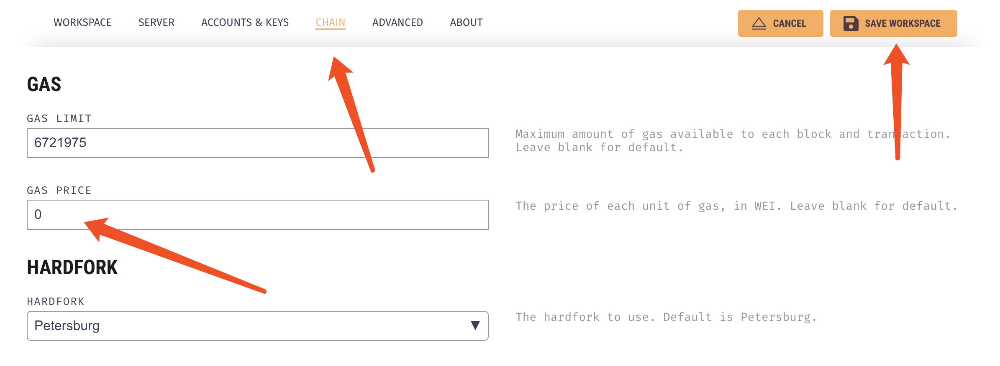
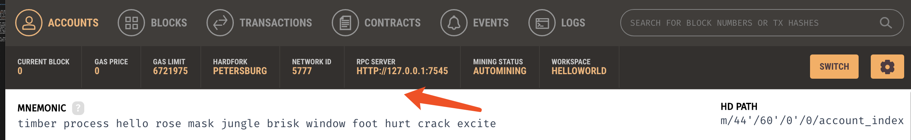
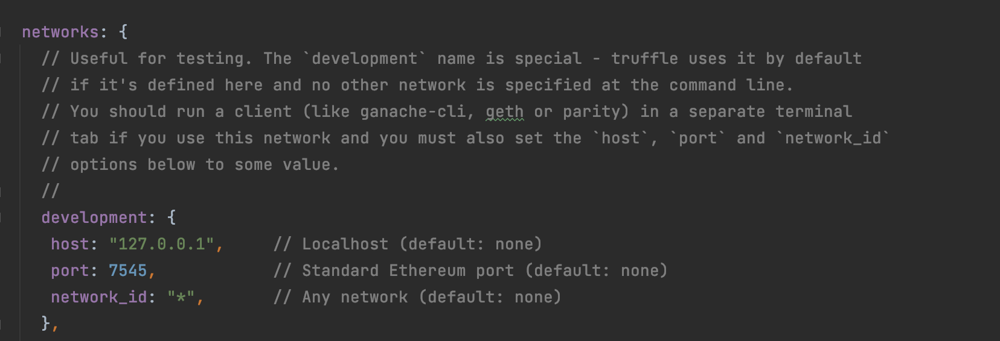
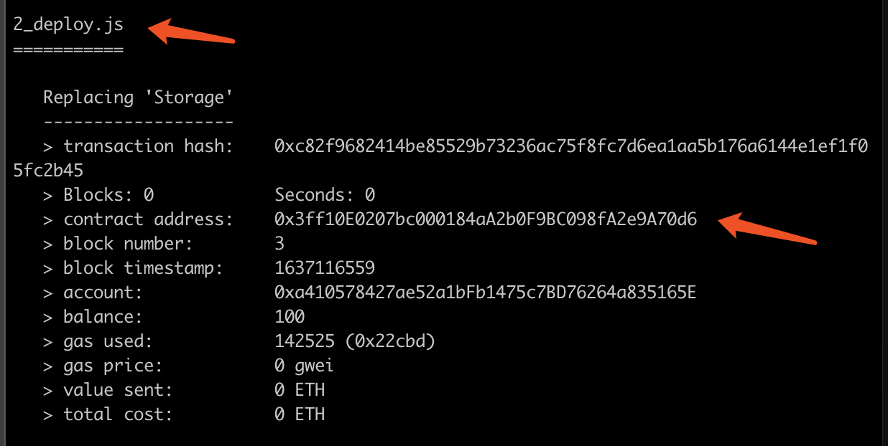

# Ethereum Development Tutorial 

In this tutorial, we will use *Ganache* to run a local blockchain testnet, use *Truffle* to deploy a smart contract, and use *web3js* to interact with the smart contract. 
To understand why we do this, we can use a client-server model as an analogy. We as a client, deploy and interact with a program (smart contract) on the server (blockchain). 


## Workflow

1\. Create a Truffle project

Download [NodeJS](https://nodejs.org/en/) and run the command `sudo npm install -g truffle` to install [Truffle](https://github.com/trufflesuite/truffle). Then, create a new project.

```
mkdir helloworld
cd helloworld
truffle init
```

2\. Set up a local Ethereum blockchain testnet

After downloading and opening [Ganache](https://github.com/trufflesuite/ganache-ui), create a new workspace.
Let's name the workspace *helloworld*. Importantly, set the gas price to zero, so we can send transactions for free. After that, save the workspace. 



Now, we need the rpc address of the testnet for the future steps. It is 127.0.0.1:7545 in my case.




3\. Connect the Truffle project to the testnet

Modify the configuration file *truffle-config.js*. By default, Truffle uses the network option *development*. The host and port should match the rpc address. 


4\. Create a smart contract

Copy and paste the following code to the file *contracts/helloworld.sol*.

```
pragma solidity >=0.7.0 <0.9.0;

contract Storage {

    uint256 number;

    function store(uint256 num) public {
        number = num;
    }

    function retrieve() public view returns (uint256){
        return number;
    }
}
```
The smart contract *Storage* is written in the language [Solidity](https://docs.soliditylang.org/en/latest/). It includes two functions. The function *store* saves a number to the blockchain. The function *retrieve* queries that number. Because this function is read-only, it is declared with the modifer *view*, meaning that we need no transaction to call the function *retrieve*. On the contrary, we need a transaction to call the function *store*.

5\. Create a script for deploying the smart contract

Copy and paste the following code to the file *migrations/2_deploy.js*.

``` javascript
const example = artifacts.require("Storage");

module.exports = function(deployer) {
  deployer.deploy(example);
};
```
In this code, the parameter "Storage" should match the name of our smart contract. Note that the script filename's prefix *2_* is necessary because it specifies the order of deploying smart contracts. The prefix *1_* is natively used by Truffle. 

6\. Deploy the smart contract

Run the command `truffle migrate`. Note that you can add the suffix `--reset` to re-deploy the smart contract.

After running this command, we can see the contract address from the command-line interface. It is *0x3ff10E0207bc000184aA2b0F9BC098fA2e9A70d6* in my case. 



Besides, we can get the file *build/contracts/Storage.json*. This json file defines the interface (or message format) to call the smart contract functions. It will be used together with the above contract address for us to interact with the smart contract.

7\. Interact with the smart contract

Under our project's root folder, *helloworld*, run the command `npm install web3` to install the package [web3js](https://web3js.readthedocs.io/en/v1.5.2/index.html). Here we also need to install another package by running `npm install @truffle/hdwallet-provider`. This package saves our efforts on signing transactions. 

Now, copy and paste the following code to the file *helloworld.js*.

``` javascript
const Web3 = require('web3')
const Provider = require('@truffle/hdwallet-provider')

// This account is to send transactions. You can create another with web3js.
const private_key = '0xe27cb51d1eb94ad42b8f196e341e082042639677df43fd7d1440c07b40e2a065'
const user_address = '0x3c62Aa7913bc303ee4B9c07Df87B556B6770E3fC'

//Set the web3 provider to the blockchain created with Ganache.
//The private key here is used to sign transactions by default.
const provider = new Provider({
	privateKeys: [private_key], 
	providerOrUrl: 'http://127.0.0.1:7545'
})
const web3 = new Web3(provider)

// Initialize the smart contract object, requiring
// 1. The json interface to call the smart contract functions
// 2. The address of the smart contract on the blockchain
const JSONInterface = require('./build/contracts/Storage.json')['abi']
const contract_address = '0x3ff10E0207bc000184aA2b0F9BC098fA2e9A70d6'
const contract = new web3.eth.Contract(JSONInterface, contract_address)

// This functions calls the store function in the smart contract. It needs a transaction.
async function store_num(num) {
	let receipt= await contract.methods.store(num).send({
		from: user_address,
		gas: 1000000,
		gasPrice: 0,
	})
	if (receipt.status !== true) {
		console.log("transaction fails")
	} 
}

// This function calls the retrieve function in the smart contract. It needs no transaction.
async function retrieve_num() {
	let num = await contract.methods.retrieve().call()
	return num
}

// Test our smart contract
async function test() {
	console.log("old num:", await retrieve_num())
	await store_num(Date.now());
	console.log("new num:", await retrieve_num())
}

test()
```
Run this code with the command `node helloworld.js`. You are supposed to output the old and new numbers stored on the blockchain.

## Remark

After you get familar with this tutorial, you can also use [geth](https://github.com/ethereum/go-ethereum) instead of Ganache to build a local blockchain testnet. It is faster and more configurable. Besides, you can also use an existing Ethereum testnet or mainnet. For this, it is more convenient to connect your project to an [Infura](https://infura.io/) blockchain node.  The existing testnets or mainnets may need transaction fees. Fortunately, many testnets like Rinkeby have the faucet to give you free ETH.

For you to edit and simply test a smart contract, a good option is to use the web-based IDE [Remix](https://remix.ethereum.org/). It also provides a virtual machine, so you can run a smart contract without having a blockchain.
Note that you also can deploy the smart contract on the blockchain with Remix. However, Truffle is more suitable for automatic deployment and testing.

## Reference

The links below are already provided throughout this tutorial. I list them again for convenience.

1\. Tools in this tutorial:

NodeJS: [https://nodejs.org/en/](https://nodejs.org/en/)

Ganache: [https://github.com/trufflesuite/ganache-ui](https://github.com/trufflesuite/ganache-ui)

Truffle: [https://github.com/trufflesuite/truffle](https://github.com/trufflesuite/truffle)

Solidity: [https://docs.soliditylang.org/en/latest/](https://docs.soliditylang.org/en/latest/)

Web3js: [https://web3js.readthedocs.io/en/v1.5.2/index.html](https://web3js.readthedocs.io/en/v1.5.2/index.html)

@truffle/hdwallet-provider: [https://www.npmjs.com/package/@truffle/hdwallet-provider](https://www.npmjs.com/package/@truffle/hdwallet-provider)

2\. Other tools:

Geth: [https://github.com/ethereum/go-ethereum](https://github.com/ethereum/go-ethereum)

Infura: [https://infura.io/](https://infura.io/)

Remix: [https://remix.ethereum.org/](https://remix.ethereum.org/)
